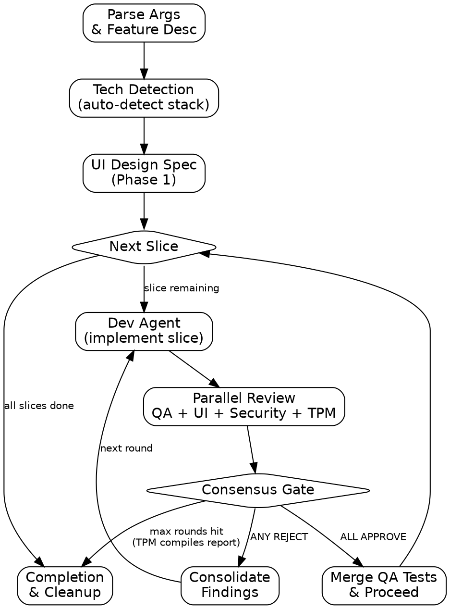

# AutoAutoSprint — Multi-Agent Feature Development

## Overview

AutoSprint dispatches 5 specialized agents in iterative rounds to build, test, validate, and document features with extreme confirmation. Each round follows the cycle: Dev implements, then QA + UI + Security + TPM review in parallel, then a consensus gate decides whether to fix or proceed.

Core principle: No feature ships until Dev, QA, UI, Security, and TPM all approve through independent verification.

## When to Use / When Not to Use

**Use AutoSprint when:**
- Building a new feature that needs comprehensive validation
- The change touches UI components, security-sensitive code, or public documentation
- You need parallel review from multiple disciplines before merging
- The feature spans multiple slices that each need independent verification

**Do NOT use AutoSprint when:**
- Fixing a quick, isolated bug (use a direct fix instead)
- Pure refactoring with no behavioral change
- Exploratory prototyping or spike work
- Trivial config or copy changes

## Agents

| Agent    | Job                                           | Isolation          | Writes Code |
|----------|-----------------------------------------------|--------------------|-------------|
| Dev      | Implements feature slices                     | Own worktree       | Yes         |
| QA       | Writes and runs real E2E tests                | Own worktree       | Yes (tests) |
| UI       | Validates structure, accessibility, responsive| Reads Dev worktree | No          |
| Security | Audits for vulnerabilities and secret leaks   | Reads Dev worktree | No          |
| TPM      | Verifies docs, API contracts, release gates   | Reads Dev worktree | No          |

## Process Flow



## Invocation

```
/autosprint add user authentication with OAuth2
/autosprint --max-rounds 5 --skip-security add payment processing
```

| Parameter         | Default | Description                                |
|-------------------|---------|--------------------------------------------|
| `--max-rounds`    | 3       | Maximum review rounds per slice            |
| `--skip-security` | false   | Skip the Security agent                    |
| `--skip-ui`       | false   | Skip the UI agent                          |
| `--skip-tpm`      | false   | Skip the TPM agent                         |

Everything after the flags is the **feature description**.

## Orchestrator Instructions

### Step 1: Initialize

1. **Parse** the feature description from the user prompt. Extract any flags (`--max-rounds`, `--skip-security`, `--skip-ui`, `--skip-tpm`).
2. **Tech detection** — run the auto-detector to identify the project stack:
   ```bash
   python3 <skill-dir>/lib/tech_detect.py <project-dir>
   ```
   Capture the JSON output; it contains `framework`, `language`, `test_runner`, `ui_library`, and more.
3. **Init autoautosprint state** — call `init_sprint` from `state_manager` by invoking:
   ```python
   from lib.state_manager import init_sprint
   init_sprint(project_dir, feature_description, tech_stack, max_rounds=N, slices=slice_list)
   ```
   This creates `.autosprint/state.json` and `.autosprint/config.json`.
4. **Start watchdog** in background:
   ```bash
   python3 <skill-dir>/lib/watchdog.py <project-dir> --loop &
   ```
5. **Add `.autosprint/` to `.gitignore`** if not already present.

### Step 2: UI Design Spec (Phase 1)

1. Dispatch the **UI agent** with Phase 1 instructions (design spec generation — no code review yet).
2. The UI agent produces a design spec covering: layout structure, component hierarchy, accessibility requirements, responsive breakpoints.
3. Store the design spec output for Dev context in subsequent steps.
4. Update agent status and display the kanban via `render_kanban`.

### Step 3: Dev Implementation (per slice)

1. Display the overview kanban (`render_overview`) showing current slice progress.
2. Dispatch the **Dev agent** with `isolation: worktree`.
3. Provide Dev with:
   - The full feature spec
   - The UI design spec from Step 2
   - The current slice description
   - Any prior review findings (from previous rounds)
4. Update agent status to `in_progress` and display kanban.
5. Wait for Dev to complete. Update status to `done`.

### Step 4: Parallel Review

1. Display kanban showing reviewers dispatching.
2. Dispatch **ALL** active reviewers **IN PARALLEL** (respect `--skip-*` flags):
   - **QA Agent** — `isolation: worktree` — writes and runs E2E tests against Dev's code
   - **UI Agent (Phase 2)** — reads Dev worktree — validates structural correctness, accessibility, responsiveness
   - **Security Agent** — reads Dev worktree — audits for vulnerabilities, secret exposure, injection vectors
   - **TPM Agent** — reads Dev worktree — verifies documentation, API contracts, changelog, release gates
3. As each reviewer completes, update its status and re-render the kanban.
4. Collect all votes and findings.

### Step 5: Consensus Gate

1. Run a watchdog health check to confirm no agents are stalled:
   ```bash
   python3 <skill-dir>/lib/watchdog.py <project-dir> --check
   ```
2. Display the consensus table using `render_consensus(project_dir, round_num)`.
3. Evaluate consensus:
   - **ALL APPROVE** — Merge QA tests into the Dev branch. Advance to next slice (back to Step 3) or completion (Step 6).
   - **ANY REJECT** — Consolidate all findings into a single brief. Dispatch Dev for the next round (back to Step 3) with the consolidated findings. Increment round counter.
   - **PENDING** — Wait and re-check. An agent may still be running.
4. If `round_num >= max_rounds` and consensus is not reached, the **TPM agent** compiles a final status report. Present the report to the user and ask whether to force-proceed or abort.

### Step 6: Completion

1. Merge any remaining QA E2E tests into the Dev branch.
2. Run a final **TPM validation** pass to confirm docs, changelog, and API contracts are complete.
3. Display the final overview kanban (`render_overview`).
4. Present a summary to the user:
   - Slices completed
   - Total rounds used
   - Consensus votes per agent
   - Any outstanding warnings
5. Clean up: kill the watchdog background process, optionally archive `.autosprint/state.json`.

## Kanban Display

At every trigger point in the workflow, render and display the kanban board using the state manager's render functions:

- `render_kanban(project_dir)` — shows agent statuses in a board layout
- `render_overview(project_dir)` — shows high-level slice progress
- `render_consensus(project_dir, round_num)` — shows vote table for a specific round

Trigger points: after initialization, before/after each Dev dispatch, as each reviewer completes, at consensus gate, and at completion.

## State Management

All state is persisted in the `.autosprint/` directory:

- `.autosprint/state.json` — current round, slice index, agent statuses, votes, findings
- `.autosprint/config.json` — feature description, tech stack, max rounds, skip flags

If a session is interrupted, the orchestrator resumes from `state.json` on next invocation. The watchdog detects stalled agents and logs warnings to `.autosprint/watchdog.log`.

## Integration

**Recommended chain:**
```
/brainstorm → /write-plan → /autosprint → /simplify → /finish-branch
```

**Skill dependencies:**
- `frontend-design` — REQUIRED by UI agent for Phase 1 design spec generation. Install via `/plugin` or ensure `frontend-design` skill is available.

**Agent prompt files:**
- `agents/dev-agent.md`
- `agents/qa-agent.md`
- `agents/ui-agent.md`
- `agents/security-agent.md`
- `agents/tpm-agent.md`

**Python library files:**
- `lib/tech_detect.py` — auto-detects project tech stack
- `lib/state_manager.py` — autosprint state, kanban rendering, consensus checking
- `lib/watchdog.py` — heartbeat monitoring, stall/timeout detection

## Red Flags — Never Do These

1. **Never skip the consensus gate.** Every round must pass through the gate, even if Dev is confident.
2. **Never let Dev self-approve.** Dev does not vote. Only QA, UI, Security, and TPM cast votes.
3. **Never mock E2E tests.** QA must run real tests against actual code. Mocked or stubbed E2E tests are a failure.
4. **Never ignore a TPM FAIL.** If TPM rejects, documentation or contract gaps exist. They must be resolved.
5. **Never exceed max rounds silently.** If max rounds are hit without consensus, surface it to the user explicitly with the TPM report.
