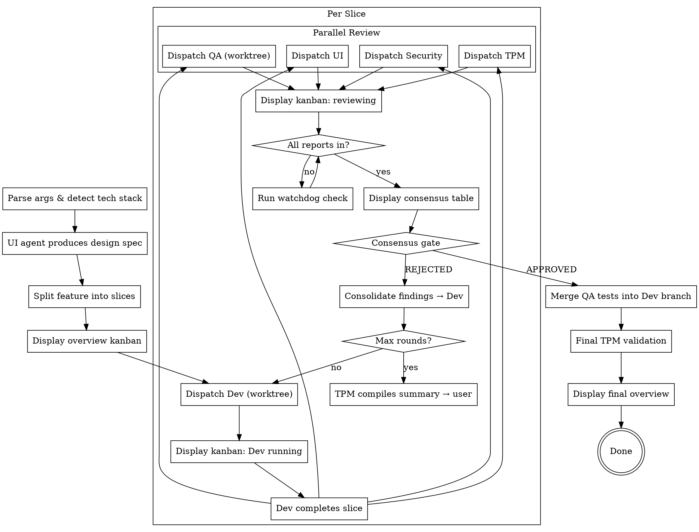

# Sprint Skill Implementation Plan

> **For Claude:** REQUIRED SUB-SKILL: Use superpowers:executing-plans to implement this plan task-by-task.

**Goal:** Build a distributable multi-agent feature development skill with 5 agents (Dev, QA, UI, Security, TPM), iterative consensus rounds, real E2E testing, and robust state management.

**Architecture:** Orchestrator SKILL.md dispatches agents via Agent tool with worktree isolation for Dev/QA. Python scripts handle state persistence, tech detection, kanban rendering, and watchdog monitoring. Agent prompts are standalone markdown files.

**Tech Stack:** Python 3 (lib scripts), Markdown (skill + agent prompts), Bash (installer)

**Design Doc:** `docs/plans/2026-03-25-sprint-skill-design.md`

---

### Task 1: Tech Stack Auto-Detection (`lib/tech-detect.py`)

**Files:**
- Create: `lib/tech-detect.py`
- Create: `tests/test_tech_detect.py`

**Step 1: Write the failing test**

```python
# tests/test_tech_detect.py
import json
import os
import tempfile
import pytest
from lib.tech_detect import detect_tech_stack

class TestTechDetect:
    def test_detects_react_web_frontend(self, tmp_path):
        (tmp_path / "package.json").write_text(json.dumps({
            "dependencies": {"react": "^18.0.0", "react-dom": "^18.0.0"}
        }))
        result = detect_tech_stack(str(tmp_path))
        assert "web-frontend" in result["stacks"]
        assert result["qa_tool"] == "playwright"
        assert result["ui_validation"] == "browser-automation"
        assert "XSS" in result["security_focus"]

    def test_detects_express_web_backend(self, tmp_path):
        (tmp_path / "package.json").write_text(json.dumps({
            "dependencies": {"express": "^4.0.0"}
        }))
        result = detect_tech_stack(str(tmp_path))
        assert "web-backend" in result["stacks"]
        assert result["qa_tool"] == "supertest"

    def test_detects_ios(self, tmp_path):
        (tmp_path / "Podfile").write_text("platform :ios, '15.0'")
        result = detect_tech_stack(str(tmp_path))
        assert "ios" in result["stacks"]
        assert result["qa_tool"] == "xctest"

    def test_detects_android(self, tmp_path):
        (tmp_path / "build.gradle").write_text("android { compileSdk 33 }")
        result = detect_tech_stack(str(tmp_path))
        assert "android" in result["stacks"]
        assert result["qa_tool"] == "maestro"

    def test_detects_flutter(self, tmp_path):
        (tmp_path / "pubspec.yaml").write_text("name: my_app\ndependencies:\n  flutter:\n    sdk: flutter")
        result = detect_tech_stack(str(tmp_path))
        assert "mobile-cross-platform" in result["stacks"]

    def test_detects_electron(self, tmp_path):
        (tmp_path / "package.json").write_text(json.dumps({
            "dependencies": {"electron": "^28.0.0"}
        }))
        result = detect_tech_stack(str(tmp_path))
        assert "desktop-electron" in result["stacks"]

    def test_detects_tauri(self, tmp_path):
        (tmp_path / "Cargo.toml").write_text('[dependencies]\ntauri = "1.0"')
        result = detect_tech_stack(str(tmp_path))
        assert "desktop-tauri" in result["stacks"]

    def test_detects_rust_cli(self, tmp_path):
        (tmp_path / "Cargo.toml").write_text('[package]\nname = "mycli"')
        result = detect_tech_stack(str(tmp_path))
        assert "cli-rust" in result["stacks"]

    def test_detects_go(self, tmp_path):
        (tmp_path / "go.mod").write_text("module github.com/user/app")
        result = detect_tech_stack(str(tmp_path))
        assert "cli-go" in result["stacks"]

    def test_detects_python(self, tmp_path):
        (tmp_path / "pyproject.toml").write_text('[project]\nname = "myapp"')
        result = detect_tech_stack(str(tmp_path))
        assert "python" in result["stacks"]

    def test_detects_multi_platform(self, tmp_path):
        (tmp_path / "package.json").write_text(json.dumps({
            "dependencies": {"react": "^18.0.0", "express": "^4.0.0"}
        }))
        result = detect_tech_stack(str(tmp_path))
        assert len(result["stacks"]) >= 2

    def test_fallback_generic(self, tmp_path):
        result = detect_tech_stack(str(tmp_path))
        assert "generic" in result["stacks"]

    def test_cli_output_json(self, tmp_path):
        """When run as script, outputs valid JSON to stdout."""
        (tmp_path / "go.mod").write_text("module github.com/user/app")
        import subprocess
        result = subprocess.run(
            ["python3", "lib/tech_detect.py", str(tmp_path)],
            capture_output=True, text=True, cwd=os.path.dirname(os.path.dirname(__file__))
        )
        assert result.returncode == 0
        data = json.loads(result.stdout)
        assert "stacks" in data
```

**Step 2: Run test to verify it fails**

Run: `python3 -m pytest tests/test_tech_detect.py -v`
Expected: FAIL with "ModuleNotFoundError: No module named 'lib.tech_detect'"

**Step 3: Write implementation**

```python
# lib/tech_detect.py
"""Tech stack auto-detection for sprint skill.

Scans project directory for config files and determines:
- Tech stack(s) detected
- QA testing tool to use
- UI validation approach
- Security focus areas

Usage:
    python3 lib/tech_detect.py /path/to/project
    # Outputs JSON to stdout
"""
import json
import os
import sys
from pathlib import Path

STACK_RULES = [
    {
        "id": "web-frontend",
        "detect": lambda p: _pkg_has_dep(p, ["react", "react-dom", "vue", "svelte", "@angular/core"]),
        "qa_tool": "playwright",
        "ui_validation": "browser-automation",
        "security_focus": ["XSS", "CSP", "CORS"],
    },
    {
        "id": "web-backend",
        "detect": lambda p: _pkg_has_dep(p, ["express", "fastify", "hono", "next", "@nestjs/core"]),
        "qa_tool": "supertest",
        "ui_validation": "none",
        "security_focus": ["SQLi", "auth", "IDOR"],
    },
    {
        "id": "desktop-electron",
        "detect": lambda p: _pkg_has_dep(p, ["electron"]),
        "qa_tool": "playwright",
        "ui_validation": "window-automation",
        "security_focus": ["node-integration", "IPC"],
    },
    {
        "id": "desktop-tauri",
        "detect": lambda p: _cargo_has_dep(p, "tauri"),
        "qa_tool": "playwright",
        "ui_validation": "window-automation",
        "security_focus": ["IPC", "command-injection"],
    },
    {
        "id": "ios",
        "detect": lambda p: (p / "Podfile").exists() or list(p.glob("*.xcodeproj")),
        "qa_tool": "xctest",
        "ui_validation": "simulator",
        "security_focus": ["keychain", "ATS", "data-leaks"],
    },
    {
        "id": "android",
        "detect": lambda p: (p / "build.gradle").exists() or (p / "AndroidManifest.xml").exists(),
        "qa_tool": "maestro",
        "ui_validation": "emulator",
        "security_focus": ["intent-injection", "storage"],
    },
    {
        "id": "mobile-cross-platform",
        "detect": lambda p: (p / "pubspec.yaml").exists(),
        "qa_tool": "maestro",
        "ui_validation": "simulator",
        "security_focus": ["platform-specific"],
    },
    {
        "id": "cli-rust",
        "detect": lambda p: (p / "Cargo.toml").exists() and not _cargo_has_dep(p, "tauri"),
        "qa_tool": "shell-e2e",
        "ui_validation": "none",
        "security_focus": ["input-validation", "path-traversal"],
    },
    {
        "id": "cli-go",
        "detect": lambda p: (p / "go.mod").exists(),
        "qa_tool": "shell-e2e",
        "ui_validation": "none",
        "security_focus": ["input-validation", "path-traversal"],
    },
    {
        "id": "python",
        "detect": lambda p: (p / "pyproject.toml").exists() or (p / "setup.py").exists(),
        "qa_tool": "pytest",
        "ui_validation": "none",
        "security_focus": ["dependency-audit", "injection"],
    },
]


def _read_json(path):
    try:
        return json.loads(path.read_text())
    except (json.JSONDecodeError, FileNotFoundError):
        return {}


def _pkg_has_dep(project_path, dep_names):
    pkg = _read_json(project_path / "package.json")
    all_deps = {**pkg.get("dependencies", {}), **pkg.get("devDependencies", {})}
    return any(d in all_deps for d in dep_names)


def _cargo_has_dep(project_path, dep_name):
    cargo = project_path / "Cargo.toml"
    if not cargo.exists():
        return False
    content = cargo.read_text()
    return dep_name in content


def detect_tech_stack(project_dir: str) -> dict:
    path = Path(project_dir)
    detected = []

    for rule in STACK_RULES:
        if rule["detect"](path):
            detected.append(rule)

    if not detected:
        return {
            "stacks": ["generic"],
            "qa_tool": "shell-e2e",
            "ui_validation": "none",
            "security_focus": ["general"],
        }

    stacks = [r["id"] for r in detected]
    # Use first detected stack's tools as primary
    primary = detected[0]
    # Merge security focus from all detected stacks
    all_security = []
    for r in detected:
        all_security.extend(r["security_focus"])

    return {
        "stacks": stacks,
        "qa_tool": primary["qa_tool"],
        "ui_validation": primary["ui_validation"],
        "security_focus": list(set(all_security)),
    }


if __name__ == "__main__":
    if len(sys.argv) < 2:
        print("Usage: python3 tech_detect.py <project_dir>", file=sys.stderr)
        sys.exit(1)
    result = detect_tech_stack(sys.argv[1])
    print(json.dumps(result, indent=2))
```

Also create `lib/__init__.py` and `tests/__init__.py` (empty files) for Python module resolution.

**Step 4: Run test to verify it passes**

Run: `python3 -m pytest tests/test_tech_detect.py -v`
Expected: All 13 tests PASS

**Step 5: Commit**

```bash
git add lib/ tests/
git commit -m "feat: add tech stack auto-detection (lib/tech_detect.py)"
```

---

### Task 2: State Manager (`lib/state-manager.py`)

**Files:**
- Create: `lib/state_manager.py`
- Create: `tests/test_state_manager.py`

**Step 1: Write the failing test**

```python
# tests/test_state_manager.py
import json
import os
import pytest
from lib.state_manager import (
    init_sprint,
    update_agent_status,
    record_vote,
    check_consensus,
    get_state,
    render_kanban,
    render_consensus,
    render_overview,
)

class TestInitSprint:
    def test_creates_sprint_directory(self, tmp_path):
        init_sprint(str(tmp_path), "add auth", ["web-frontend"], max_rounds=3, slices=["auth flow", "token refresh"])
        assert (tmp_path / ".sprint").is_dir()
        assert (tmp_path / ".sprint" / "state.json").exists()
        assert (tmp_path / ".sprint" / "config.json").exists()
        assert (tmp_path / ".sprint" / "rounds").is_dir()
        assert (tmp_path / ".sprint" / "logs").is_dir()

    def test_state_json_structure(self, tmp_path):
        init_sprint(str(tmp_path), "add auth", ["web-frontend"], max_rounds=5, slices=["slice1"])
        state = json.loads((tmp_path / ".sprint" / "state.json").read_text())
        assert state["feature"] == "add auth"
        assert state["techStack"] == ["web-frontend"]
        assert state["maxRounds"] == 5
        assert state["currentSlice"] == 1
        assert state["totalSlices"] == 1
        assert state["currentRound"] == 1
        assert state["phase"] == "setup"
        for agent in ["dev", "qa", "ui", "security", "tpm"]:
            assert agent in state["agents"]
            assert state["agents"][agent]["status"] == "pending"

    def test_adds_gitignore(self, tmp_path):
        init_sprint(str(tmp_path), "feat", ["python"], slices=["s1"])
        gitignore = tmp_path / ".gitignore"
        assert ".sprint/" in gitignore.read_text()

    def test_appends_gitignore_if_exists(self, tmp_path):
        (tmp_path / ".gitignore").write_text("node_modules/\n")
        init_sprint(str(tmp_path), "feat", ["python"], slices=["s1"])
        content = (tmp_path / ".gitignore").read_text()
        assert "node_modules/" in content
        assert ".sprint/" in content


class TestUpdateAgentStatus:
    def test_updates_status_and_last_activity(self, tmp_path):
        init_sprint(str(tmp_path), "feat", ["python"], slices=["s1"])
        update_agent_status(str(tmp_path), "dev", "running")
        state = get_state(str(tmp_path))
        assert state["agents"]["dev"]["status"] == "running"
        assert state["agents"]["dev"]["lastActivity"] is not None

    def test_updates_phase(self, tmp_path):
        init_sprint(str(tmp_path), "feat", ["python"], slices=["s1"])
        update_agent_status(str(tmp_path), "dev", "completed", phase="reviewing")
        state = get_state(str(tmp_path))
        assert state["phase"] == "reviewing"


class TestConsensus:
    def test_record_vote_pass(self, tmp_path):
        init_sprint(str(tmp_path), "feat", ["python"], slices=["s1"])
        record_vote(str(tmp_path), 1, "qa", "PASS", "all tests pass")
        state = get_state(str(tmp_path))
        assert state["consensus"]["round-1"]["qa"]["vote"] == "PASS"

    def test_record_vote_fail(self, tmp_path):
        init_sprint(str(tmp_path), "feat", ["python"], slices=["s1"])
        record_vote(str(tmp_path), 1, "ui", "FAIL", "missing loading state")
        state = get_state(str(tmp_path))
        assert state["consensus"]["round-1"]["ui"]["vote"] == "FAIL"

    def test_consensus_all_pass(self, tmp_path):
        init_sprint(str(tmp_path), "feat", ["python"], slices=["s1"])
        for agent in ["qa", "ui", "security", "tpm"]:
            record_vote(str(tmp_path), 1, agent, "PASS", "ok")
        assert check_consensus(str(tmp_path), 1) == "APPROVED"

    def test_consensus_any_fail(self, tmp_path):
        init_sprint(str(tmp_path), "feat", ["python"], slices=["s1"])
        record_vote(str(tmp_path), 1, "qa", "PASS", "ok")
        record_vote(str(tmp_path), 1, "ui", "FAIL", "issue")
        record_vote(str(tmp_path), 1, "security", "PASS", "ok")
        record_vote(str(tmp_path), 1, "tpm", "PASS", "ok")
        assert check_consensus(str(tmp_path), 1) == "REJECTED"

    def test_consensus_tpm_override(self, tmp_path):
        init_sprint(str(tmp_path), "feat", ["python"], slices=["s1"])
        record_vote(str(tmp_path), 1, "qa", "PASS", "ok")
        record_vote(str(tmp_path), 1, "ui", "FAIL", "minor issue")
        record_vote(str(tmp_path), 1, "security", "PASS", "ok")
        record_vote(str(tmp_path), 1, "tpm", "OVERRIDE", "trivial remaining issues")
        assert check_consensus(str(tmp_path), 1) == "APPROVED"

    def test_consensus_incomplete(self, tmp_path):
        init_sprint(str(tmp_path), "feat", ["python"], slices=["s1"])
        record_vote(str(tmp_path), 1, "qa", "PASS", "ok")
        assert check_consensus(str(tmp_path), 1) == "PENDING"


class TestKanbanRendering:
    def test_render_kanban_markdown(self, tmp_path):
        init_sprint(str(tmp_path), "add auth", ["web-frontend"], slices=["auth flow"])
        update_agent_status(str(tmp_path), "dev", "completed")
        update_agent_status(str(tmp_path), "qa", "running")
        output = render_kanban(str(tmp_path))
        assert "| Agent" in output
        assert "Dev" in output
        assert "| QA" in output
        assert "add auth" in output

    def test_render_consensus_markdown(self, tmp_path):
        init_sprint(str(tmp_path), "feat", ["python"], slices=["s1"])
        record_vote(str(tmp_path), 1, "qa", "PASS", "8/8 tests pass")
        record_vote(str(tmp_path), 1, "ui", "FAIL", "missing state")
        output = render_consensus(str(tmp_path), 1)
        assert "| Agent" in output
        assert "Vote" in output
        assert "PASS" in output
        assert "FAIL" in output

    def test_render_overview_markdown(self, tmp_path):
        init_sprint(str(tmp_path), "add auth", ["web-frontend"], slices=["auth", "tokens", "rbac"])
        output = render_overview(str(tmp_path))
        assert "| Slice" in output
        assert "auth" in output
        assert "tokens" in output
        assert "rbac" in output

    def test_render_kanban_json(self, tmp_path):
        init_sprint(str(tmp_path), "feat", ["python"], slices=["s1"])
        output = render_kanban(str(tmp_path), fmt="json")
        data = json.loads(output)
        assert "agents" in data
```

**Step 2: Run test to verify it fails**

Run: `python3 -m pytest tests/test_state_manager.py -v`
Expected: FAIL with "ModuleNotFoundError"

**Step 3: Write implementation**

```python
# lib/state_manager.py
"""State management and kanban rendering for sprint skill.

Manages .sprint/ directory lifecycle:
- Initialize sprint state
- Update agent statuses with timestamps
- Record consensus votes
- Render kanban dashboards as markdown or JSON

Usage:
    from lib.state_manager import init_sprint, update_agent_status, render_kanban
"""
import json
import os
from datetime import datetime, timezone
from pathlib import Path

AGENTS = ["dev", "qa", "ui", "security", "tpm"]
REVIEWERS = ["qa", "ui", "security", "tpm"]


def _sprint_dir(project_dir: str) -> Path:
    return Path(project_dir) / ".sprint"


def _state_path(project_dir: str) -> Path:
    return _sprint_dir(project_dir) / "state.json"


def _write_state(project_dir: str, state: dict):
    _state_path(project_dir).write_text(json.dumps(state, indent=2))


def get_state(project_dir: str) -> dict:
    return json.loads(_state_path(project_dir).read_text())


def init_sprint(
    project_dir: str,
    feature: str,
    tech_stack: list,
    max_rounds: int = 3,
    slices: list = None,
):
    slices = slices or ["main"]
    sprint = _sprint_dir(project_dir)
    sprint.mkdir(exist_ok=True)
    (sprint / "rounds").mkdir(exist_ok=True)
    (sprint / "logs").mkdir(exist_ok=True)

    state = {
        "feature": feature,
        "techStack": tech_stack,
        "currentSlice": 1,
        "totalSlices": len(slices),
        "slices": slices,
        "currentRound": 1,
        "maxRounds": max_rounds,
        "phase": "setup",
        "agents": {
            agent: {"status": "pending", "lastActivity": None, "worktree": None}
            for agent in AGENTS
        },
        "consensus": {},
    }
    _write_state(project_dir, state)

    config = {
        "feature": feature,
        "techStack": tech_stack,
        "maxRounds": max_rounds,
        "slices": slices,
        "stallThreshold": 180,
        "agentTimeout": 600,
    }
    (sprint / "config.json").write_text(json.dumps(config, indent=2))

    # Add .sprint/ to .gitignore
    gitignore = Path(project_dir) / ".gitignore"
    if gitignore.exists():
        content = gitignore.read_text()
        if ".sprint/" not in content:
            gitignore.write_text(content.rstrip("\n") + "\n.sprint/\n")
    else:
        gitignore.write_text(".sprint/\n")


def update_agent_status(
    project_dir: str, agent: str, status: str, phase: str = None
):
    state = get_state(project_dir)
    state["agents"][agent]["status"] = status
    state["agents"][agent]["lastActivity"] = datetime.now(timezone.utc).isoformat()
    if phase:
        state["phase"] = phase
    _write_state(project_dir, state)


def record_vote(
    project_dir: str, round_num: int, agent: str, vote: str, summary: str
):
    state = get_state(project_dir)
    round_key = f"round-{round_num}"
    if round_key not in state["consensus"]:
        state["consensus"][round_key] = {a: None for a in REVIEWERS}
    state["consensus"][round_key][agent] = {"vote": vote, "summary": summary}

    # Also write report file
    round_dir = _sprint_dir(project_dir) / "rounds" / round_key
    round_dir.mkdir(parents=True, exist_ok=True)
    report = {"vote": vote, "summary": summary, "timestamp": datetime.now(timezone.utc).isoformat()}
    (round_dir / f"{agent}-report.json").write_text(json.dumps(report, indent=2))

    _write_state(project_dir, state)


def check_consensus(project_dir: str, round_num: int) -> str:
    state = get_state(project_dir)
    round_key = f"round-{round_num}"
    votes = state.get("consensus", {}).get(round_key, {})

    for agent in REVIEWERS:
        if votes.get(agent) is None:
            return "PENDING"

    has_override = any(
        votes[a]["vote"] == "OVERRIDE" for a in REVIEWERS if votes[a]
    )
    has_fail = any(
        votes[a]["vote"] == "FAIL" for a in REVIEWERS if votes[a]
    )

    if has_fail and not has_override:
        return "REJECTED"
    return "APPROVED"


def render_kanban(project_dir: str, fmt: str = "markdown") -> str:
    state = get_state(project_dir)

    if fmt == "json":
        return json.dumps({"agents": state["agents"], "phase": state["phase"]}, indent=2)

    feature = state["feature"]
    slice_num = state["currentSlice"]
    total = state["totalSlices"]
    round_num = state["currentRound"]
    max_rounds = state["maxRounds"]

    lines = [
        f"## Sprint: {feature}",
        f"**Slice {slice_num}/{total} | Round {round_num}/{max_rounds}**",
        "",
        "| Agent | Pending | In Progress | Done | Verdict |",
        "|-------|---------|-------------|------|---------|",
    ]

    for agent in AGENTS:
        info = state["agents"][agent]
        s = info["status"]
        row = {"pending": "", "in_progress": "", "done": "", "verdict": ""}
        if s == "pending":
            row["pending"] = "Waiting"
        elif s == "running":
            row["in_progress"] = "Running"
        elif s == "completed":
            row["done"] = "Done"
            row["verdict"] = "completed"
        elif s == "TIMEOUT":
            row["verdict"] = "TIMEOUT"
        name = agent.upper() if agent in ("qa", "tpm") else agent.capitalize()
        lines.append(f"| {name} | {row['pending']} | {row['in_progress']} | {row['done']} | {row['verdict']} |")

    done_count = sum(1 for a in AGENTS if state["agents"][a]["status"] == "completed")
    lines.append("")
    lines.append(f"> Progress: {done_count}/{len(AGENTS)} agents complete")

    return "\n".join(lines)


def render_consensus(project_dir: str, round_num: int) -> str:
    state = get_state(project_dir)
    round_key = f"round-{round_num}"
    votes = state.get("consensus", {}).get(round_key, {})

    feature = state["feature"]
    slice_num = state["currentSlice"]
    total = state["totalSlices"]

    lines = [
        f"## Consensus — Slice {slice_num}/{total} | Round {round_num}/{state['maxRounds']}",
        "",
        "| Agent | Vote | Summary |",
        "|-------|------|---------|",
    ]

    for agent in REVIEWERS:
        v = votes.get(agent)
        if v:
            name = agent.upper() if agent in ("qa", "tpm") else agent.capitalize()
            lines.append(f"| {name} | {v['vote']} | {v['summary']} |")

    result = check_consensus(project_dir, round_num)
    lines.append("")
    lines.append(f"> Result: {result}")

    return "\n".join(lines)


def render_overview(project_dir: str) -> str:
    state = get_state(project_dir)
    feature = state["feature"]
    slices = state.get("slices", [])

    lines = [
        f"## Sprint Overview: {feature}",
        "",
        "| Slice | Status | Rounds | Agents | Notes |",
        "|-------|--------|--------|--------|-------|",
    ]

    current = state["currentSlice"]
    for i, s in enumerate(slices, 1):
        if i < current:
            lines.append(f"| {i}. {s} | Done | — | 5/5 | |")
        elif i == current:
            r = state["currentRound"]
            mr = state["maxRounds"]
            done = sum(1 for a in AGENTS if state["agents"][a]["status"] == "completed")
            lines.append(f"| {i}. {s} | Round {r} | {r}/{mr} | {done}/5 | |")
        else:
            lines.append(f"| {i}. {s} | Pending | — | — | |")

    completed = current - 1
    lines.append("")
    lines.append(f"> Overall: {completed}/{len(slices)} slices complete")

    return "\n".join(lines)


if __name__ == "__main__":
    import sys
    if len(sys.argv) < 2:
        print("Usage: python3 state_manager.py <project_dir> [kanban|consensus|overview]", file=sys.stderr)
        sys.exit(1)
    project = sys.argv[1]
    cmd = sys.argv[2] if len(sys.argv) > 2 else "kanban"
    if cmd == "kanban":
        print(render_kanban(project))
    elif cmd == "consensus":
        rnd = int(sys.argv[3]) if len(sys.argv) > 3 else 1
        print(render_consensus(project, rnd))
    elif cmd == "overview":
        print(render_overview(project))
```

**Step 4: Run test to verify it passes**

Run: `python3 -m pytest tests/test_state_manager.py -v`
Expected: All tests PASS

**Step 5: Commit**

```bash
git add lib/state_manager.py tests/test_state_manager.py
git commit -m "feat: add state manager with kanban rendering (lib/state_manager.py)"
```

---

### Task 3: Watchdog (`lib/watchdog.py`)

**Files:**
- Create: `lib/watchdog.py`
- Create: `tests/test_watchdog.py`

**Step 1: Write the failing test**

```python
# tests/test_watchdog.py
import json
import pytest
from datetime import datetime, timezone, timedelta
from lib.state_manager import init_sprint, update_agent_status
from lib.watchdog import check_agents, WatchdogAlert

class TestWatchdog:
    def test_no_alerts_for_pending_agents(self, tmp_path):
        init_sprint(str(tmp_path), "feat", ["python"], slices=["s1"])
        alerts = check_agents(str(tmp_path))
        assert alerts == []

    def test_no_alerts_for_recent_activity(self, tmp_path):
        init_sprint(str(tmp_path), "feat", ["python"], slices=["s1"])
        update_agent_status(str(tmp_path), "dev", "running")
        alerts = check_agents(str(tmp_path))
        assert alerts == []

    def test_stall_alert_for_old_activity(self, tmp_path):
        init_sprint(str(tmp_path), "feat", ["python"], slices=["s1"])
        update_agent_status(str(tmp_path), "dev", "running")
        # Manually backdate lastActivity
        state = json.loads((tmp_path / ".sprint" / "state.json").read_text())
        old_time = (datetime.now(timezone.utc) - timedelta(seconds=200)).isoformat()
        state["agents"]["dev"]["lastActivity"] = old_time
        (tmp_path / ".sprint" / "state.json").write_text(json.dumps(state))

        alerts = check_agents(str(tmp_path), stall_threshold=180)
        assert len(alerts) == 1
        assert alerts[0].agent == "dev"
        assert alerts[0].alert_type == "STALLED"

    def test_timeout_alert(self, tmp_path):
        init_sprint(str(tmp_path), "feat", ["python"], slices=["s1"])
        update_agent_status(str(tmp_path), "dev", "running")
        state = json.loads((tmp_path / ".sprint" / "state.json").read_text())
        old_time = (datetime.now(timezone.utc) - timedelta(seconds=700)).isoformat()
        state["agents"]["dev"]["lastActivity"] = old_time
        (tmp_path / ".sprint" / "state.json").write_text(json.dumps(state))

        alerts = check_agents(str(tmp_path), stall_threshold=180, agent_timeout=600)
        assert len(alerts) == 1
        assert alerts[0].alert_type == "TIMEOUT"

    def test_timeout_updates_state(self, tmp_path):
        init_sprint(str(tmp_path), "feat", ["python"], slices=["s1"])
        update_agent_status(str(tmp_path), "dev", "running")
        state = json.loads((tmp_path / ".sprint" / "state.json").read_text())
        old_time = (datetime.now(timezone.utc) - timedelta(seconds=700)).isoformat()
        state["agents"]["dev"]["lastActivity"] = old_time
        (tmp_path / ".sprint" / "state.json").write_text(json.dumps(state))

        check_agents(str(tmp_path), stall_threshold=180, agent_timeout=600)
        state = json.loads((tmp_path / ".sprint" / "state.json").read_text())
        assert state["agents"]["dev"]["status"] == "TIMEOUT"

    def test_completed_agents_ignored(self, tmp_path):
        init_sprint(str(tmp_path), "feat", ["python"], slices=["s1"])
        update_agent_status(str(tmp_path), "dev", "completed")
        alerts = check_agents(str(tmp_path))
        assert alerts == []

    def test_round_completion_detection(self, tmp_path):
        init_sprint(str(tmp_path), "feat", ["python"], slices=["s1"])
        # Create all reviewer reports
        round_dir = tmp_path / ".sprint" / "rounds" / "round-1"
        round_dir.mkdir(parents=True, exist_ok=True)
        for agent in ["qa", "ui", "security", "tpm"]:
            (round_dir / f"{agent}-report.json").write_text(json.dumps({"vote": "PASS"}))

        alerts = check_agents(str(tmp_path))
        state = json.loads((tmp_path / ".sprint" / "state.json").read_text())
        assert state["phase"] == "consensus_ready"
```

**Step 2: Run test to verify it fails**

Run: `python3 -m pytest tests/test_watchdog.py -v`
Expected: FAIL with "ModuleNotFoundError"

**Step 3: Write implementation**

```python
# lib/watchdog.py
"""Watchdog for sprint skill — monitors agent health and detects issues.

Checks:
- Heartbeat: agents update lastActivity on every action
- Stall detection: agent idle >3min while running
- Timeout: agent exceeds max time per round
- Round completion: all reviewers have reports
- Crash recovery: running agents with no activity

Usage:
    python3 lib/watchdog.py <project_dir> [--once | --loop]
"""
import json
import sys
import time
from dataclasses import dataclass
from datetime import datetime, timezone, timedelta
from pathlib import Path

REVIEWERS = ["qa", "ui", "security", "tpm"]


@dataclass
class WatchdogAlert:
    agent: str
    alert_type: str  # STALLED, TIMEOUT, ROUND_COMPLETE
    message: str
    idle_seconds: float = 0


def check_agents(
    project_dir: str,
    stall_threshold: int = 180,
    agent_timeout: int = 600,
) -> list[WatchdogAlert]:
    sprint_dir = Path(project_dir) / ".sprint"
    state_path = sprint_dir / "state.json"
    if not state_path.exists():
        return []

    state = json.loads(state_path.read_text())
    now = datetime.now(timezone.utc)
    alerts = []

    for name, agent in state["agents"].items():
        if agent["status"] != "running":
            continue
        if agent["lastActivity"] is None:
            continue

        last = datetime.fromisoformat(agent["lastActivity"])
        idle = (now - last).total_seconds()

        if idle > agent_timeout:
            agent["status"] = "TIMEOUT"
            alerts.append(WatchdogAlert(
                agent=name,
                alert_type="TIMEOUT",
                message=f"{name}: TIMEOUT after {idle:.0f}s",
                idle_seconds=idle,
            ))
        elif idle > stall_threshold:
            alerts.append(WatchdogAlert(
                agent=name,
                alert_type="STALLED",
                message=f"{name}: STALLED for {idle:.0f}s",
                idle_seconds=idle,
            ))

    # Check round completion
    round_key = f"round-{state['currentRound']}"
    round_dir = sprint_dir / "rounds" / round_key
    if round_dir.exists():
        all_reports = all(
            (round_dir / f"{agent}-report.json").exists()
            for agent in REVIEWERS
        )
        if all_reports and state["phase"] != "consensus_ready":
            state["phase"] = "consensus_ready"

    # Write back state
    state_path.write_text(json.dumps(state, indent=2))

    return alerts


def run_loop(project_dir: str, interval: int = 30, stall_threshold: int = 180, agent_timeout: int = 600):
    while True:
        alerts = check_agents(project_dir, stall_threshold, agent_timeout)
        if alerts:
            for a in alerts:
                print(f"[watchdog] {a.message}", file=sys.stderr)
        time.sleep(interval)


if __name__ == "__main__":
    if len(sys.argv) < 2:
        print("Usage: python3 watchdog.py <project_dir> [--once|--loop]", file=sys.stderr)
        sys.exit(1)

    project = sys.argv[1]
    mode = sys.argv[2] if len(sys.argv) > 2 else "--once"

    if mode == "--loop":
        run_loop(project)
    else:
        alerts = check_agents(project)
        for a in alerts:
            print(f"[watchdog] {a.message}")
```

**Step 4: Run test to verify it passes**

Run: `python3 -m pytest tests/test_watchdog.py -v`
Expected: All 7 tests PASS

**Step 5: Commit**

```bash
git add lib/watchdog.py tests/test_watchdog.py
git commit -m "feat: add watchdog with heartbeat, stall, timeout detection (lib/watchdog.py)"
```

---

### Task 4: Templates (`templates/`)

**Files:**
- Create: `templates/state.json`
- Create: `templates/config.json`

**Step 1: Create state.json template**

```json
{
  "feature": "",
  "techStack": [],
  "currentSlice": 1,
  "totalSlices": 1,
  "slices": [],
  "currentRound": 1,
  "maxRounds": 3,
  "phase": "setup",
  "agents": {
    "dev":      { "status": "pending", "worktree": null, "lastActivity": null },
    "qa":       { "status": "pending", "worktree": null, "lastActivity": null },
    "ui":       { "status": "pending", "lastActivity": null },
    "security": { "status": "pending", "lastActivity": null },
    "tpm":      { "status": "pending", "lastActivity": null }
  },
  "consensus": {}
}
```

**Step 2: Create config.json template**

```json
{
  "feature": "",
  "techStack": [],
  "maxRounds": 3,
  "slices": [],
  "stallThreshold": 180,
  "agentTimeout": 600,
  "skipSecurity": false,
  "skipUi": false,
  "skipTpm": false
}
```

**Step 3: Commit**

```bash
git add templates/
git commit -m "feat: add state and config JSON templates"
```

---

### Task 5: Agent Prompts (`agents/`)

**Files:**
- Create: `agents/dev-agent.md`
- Create: `agents/qa-agent.md`
- Create: `agents/ui-agent.md`
- Create: `agents/security-agent.md`
- Create: `agents/tpm-agent.md`

Each agent prompt is a standalone markdown file loaded by the orchestrator and injected into the Agent tool's prompt parameter with template variables filled in.

**Step 1: Create `agents/dev-agent.md`**

```markdown
# Dev Agent

You are the Dev agent in a sprint workflow. You implement feature slices per spec and write unit tests.

## Your Mandate

- Implement exactly what the feature slice specifies
- Write unit tests for your implementation
- Follow existing project patterns and conventions
- Commit with clear messages after each meaningful change
- Fix issues reported by reviewer agents in subsequent rounds

## Context

- **Feature:** {{feature}}
- **Tech Stack:** {{techStack}}
- **Current Slice:** {{sliceDescription}}
- **Design Spec:** {{uiDesignSpec}}
- **Round:** {{currentRound}} of {{maxRounds}}
{{#reviewerFindings}}

## Reviewer Findings to Fix (Round {{currentRound}})

{{reviewerFindings}}
{{/reviewerFindings}}

## Working Directory

You are working in your own isolated worktree. Make all changes here.

## Heartbeat

After every significant action (file written, test run, commit made), run:
```bash
python3 {{sprintLibPath}}/state_manager.py {{projectDir}} heartbeat dev
```

## Process

1. Read the slice spec and design spec carefully
2. If anything is unclear, ask questions before starting
3. Write unit tests first for the behavior you're implementing
4. Run tests to confirm they fail
5. Implement the minimal code to make tests pass
6. Run full test suite to ensure no regressions
7. Commit your work

## Output

When done, write your report to `.sprint/rounds/round-{{currentRound}}/dev-report.json`:

```json
{
  "status": "completed",
  "filesChanged": ["list", "of", "files"],
  "testsWritten": ["list", "of", "test", "files"],
  "testResults": "X passed, Y failed",
  "commitSha": "abc123",
  "notes": "any relevant notes"
}
```

## Rules

- Do NOT modify files outside your slice scope
- Do NOT skip tests
- Do NOT commit failing tests
- Do NOT over-engineer — implement what the spec says, nothing more
```

**Step 2: Create `agents/qa-agent.md`**

```markdown
# QA Agent

You are the QA agent. You write and run REAL end-to-end tests. Never use mocks for E2E.

## Your Mandate

- Write E2E tests that exercise the actual running application
- Tests must cover happy path + edge cases from the slice spec
- Run tests and report real pass/fail results
- Use the appropriate testing tool for the detected tech stack

## Context

- **Feature:** {{feature}}
- **Tech Stack:** {{techStack}}
- **Current Slice:** {{sliceDescription}}
- **QA Tool:** {{qaTool}}
- **Round:** {{currentRound}} of {{maxRounds}}

## Testing Tools by Stack

| Stack | Tool | Notes |
|-------|------|-------|
| web-frontend | Playwright | Headless Chromium, real browser |
| web-backend | Supertest / httpx | Real HTTP requests |
| ios | XCTest / Detox | Simulator required |
| android | Maestro / Espresso | Emulator required |
| mobile-cross-platform | Detox or Maestro | Per platform |
| desktop-electron | Playwright | Window automation |
| desktop-tauri | Playwright | Window automation |
| cli-rust / cli-go | Shell scripts | stdin/stdout/stderr/exit codes |
| python | pytest + subprocess | Integration tests |

## Working Directory

You are working in your own isolated worktree. Write tests here. Pull Dev's latest changes before testing:
```bash
git pull origin {{devBranch}}
```

## Anti-Mock Rule

You MUST start the actual application and test against it. Specifically:

- NO `jest.mock()` or equivalent for E2E tests
- NO MSW/nock interceptors pretending to be the backend
- NO fake backends or in-memory databases for E2E
- The app MUST be running. The browser/device MUST be real or headless-real.

Unit test mocks are Dev's responsibility. Your tests hit the real thing.

## Heartbeat

After every significant action, run:
```bash
python3 {{sprintLibPath}}/state_manager.py {{projectDir}} heartbeat qa
```

## Process

1. Pull latest from Dev's worktree branch
2. Read the slice spec to understand expected behavior
3. Write E2E test file(s) covering:
   - Happy path (primary user flow)
   - Error states (invalid input, missing data, network errors if applicable)
   - Edge cases (empty state, boundary values, concurrent actions)
4. Start the application
5. Run E2E tests against the running app
6. Record results

## Output

Write your report to `.sprint/rounds/round-{{currentRound}}/qa-report.json`:

```json
{
  "vote": "PASS or FAIL",
  "summary": "X/Y E2E tests passing",
  "testsWritten": ["list", "of", "e2e", "test", "files"],
  "testResults": {
    "passed": ["test names"],
    "failed": ["test names with failure reason"]
  },
  "issues": ["list of issues if FAIL"]
}
```

## Rules

- NEVER mock external services in E2E tests
- NEVER report PASS if any E2E test fails
- NEVER skip test execution — run them, don't just write them
- If the app cannot start, vote FAIL with the startup error
```

**Step 3: Create `agents/ui-agent.md`**

```markdown
# UI Agent

You validate that the implementation matches the design spec through structural and interactive validation.

## Your Mandate

### Phase 1: Pre-Dev (Design Spec)

Before Dev starts, produce a design spec covering:
- Component tree with hierarchy and naming
- Responsive breakpoints (mobile, tablet, desktop)
- Accessibility requirements (ARIA roles, keyboard navigation, screen reader labels)
- Interaction specs (hover, click, transitions, loading states, error states)
- Design system tokens to use (spacing, colors, typography)

### Phase 2: Post-Dev (Validation)

After Dev implements, validate the implementation.

## Context

- **Feature:** {{feature}}
- **Tech Stack:** {{techStack}}
- **Current Slice:** {{sliceDescription}}
- **UI Validation Mode:** {{uiValidation}}
- **Round:** {{currentRound}} of {{maxRounds}}

## Structural Validation

Read Dev's code and verify:
- Component tree matches the design spec hierarchy
- Design system tokens are used correctly (not hardcoded values)
- Accessibility: ARIA roles present, keyboard navigation works, labels exist
- Responsive: breakpoints implemented, layout adapts correctly
- Semantic HTML: correct elements used (button not div, nav not ul)

## Interactive Validation

Using browser automation (Playwright or equivalent):
1. Launch the app
2. Navigate to the feature's entry point
3. Execute each UX flow from the slice spec:
   - Click through primary flow
   - Test keyboard navigation (tab, enter, escape)
   - Resize viewport to each breakpoint
   - Trigger loading states
   - Trigger error states
   - Verify transitions and animations
4. Document any deviation from design spec

## Heartbeat

After every significant action, run:
```bash
python3 {{sprintLibPath}}/state_manager.py {{projectDir}} heartbeat ui
```

## Output

Write your report to `.sprint/rounds/round-{{currentRound}}/ui-report.json`:

```json
{
  "vote": "PASS or FAIL",
  "summary": "brief summary",
  "structural": {
    "componentTree": "PASS or FAIL with details",
    "designTokens": "PASS or FAIL with details",
    "accessibility": "PASS or FAIL with details",
    "responsive": "PASS or FAIL with details"
  },
  "interactive": {
    "flowsTested": ["list of flows"],
    "issues": ["deviations from design spec"]
  }
}
```

## Rules

- In Phase 1, produce the design spec BEFORE Dev starts — do not wait
- In Phase 2, you are READ-ONLY on Dev's worktree — do not modify code
- FAIL if accessibility requirements are not met
- FAIL if interactive flows deviate from design spec
- PASS only if both structural AND interactive validation succeed
```

**Step 4: Create `agents/security-agent.md`**

```markdown
# Security Agent

You audit the implementation for security vulnerabilities. You are adversarial by design — assume code is insecure until proven otherwise.

## Your Mandate

- Review changed code against OWASP Top 10
- Audit dependencies for known CVEs
- Scan for hardcoded secrets
- Review auth/authz logic if applicable
- Apply stack-specific security checks

## Context

- **Feature:** {{feature}}
- **Tech Stack:** {{techStack}}
- **Current Slice:** {{sliceDescription}}
- **Security Focus:** {{securityFocus}}
- **Round:** {{currentRound}} of {{maxRounds}}

## Checks by Category

### OWASP Top 10

1. **Injection** — SQL, NoSQL, OS command, LDAP injection in user inputs
2. **Broken Auth** — weak session management, credential exposure
3. **Sensitive Data Exposure** — unencrypted data, verbose errors leaking internals
4. **XXE** — XML external entity processing
5. **Broken Access Control** — IDOR, privilege escalation, missing authz checks
6. **Security Misconfig** — default credentials, unnecessary features enabled
7. **XSS** — reflected, stored, DOM-based cross-site scripting
8. **Insecure Deserialization** — untrusted data deserialization
9. **Vulnerable Components** — known CVEs in dependencies
10. **Insufficient Logging** — security events not logged

### Stack-Specific Checks

| Stack | Additional Checks |
|-------|-------------------|
| web-frontend | CSP headers, CORS policy, cookie flags, DOM manipulation |
| web-backend | Rate limiting, input validation, SQL parameterization |
| ios | Keychain usage, ATS config, data protection API |
| android | Intent filters, storage encryption, WebView config |
| desktop-electron | nodeIntegration, contextIsolation, IPC validation |
| cli | Argument injection, path traversal, file permissions |

### Dependency Audit

- Check package lock files for known CVEs
- Flag outdated dependencies with known vulnerabilities
- Check for typosquatting risks in new dependencies

### Secrets Scanning

- Hardcoded API keys, tokens, passwords
- `.env` files committed or referenced without `.env.example`
- Private keys, certificates in source

## Severity Levels

- **CRITICAL** — Exploitable now, blocks release (e.g., SQL injection in login)
- **HIGH** — Exploitable with effort, should fix before merge (e.g., missing CSRF)
- **MEDIUM** — Defense-in-depth concern (e.g., verbose error messages)
- **LOW** — Best practice suggestion (e.g., could add rate limiting)

## Heartbeat

After every significant action, run:
```bash
python3 {{sprintLibPath}}/state_manager.py {{projectDir}} heartbeat security
```

## Output

Write your report to `.sprint/rounds/round-{{currentRound}}/security-report.json`:

```json
{
  "vote": "PASS or FAIL",
  "summary": "brief summary",
  "findings": [
    {
      "severity": "CRITICAL|HIGH|MEDIUM|LOW",
      "category": "OWASP category or stack-specific",
      "file": "path/to/file.py",
      "line": 42,
      "description": "what's wrong",
      "recommendation": "how to fix"
    }
  ],
  "dependencyAudit": "PASS or list of CVEs",
  "secretsScan": "PASS or list of findings"
}
```

## Rules

- You are READ-ONLY on Dev's worktree — do not modify code
- Vote FAIL if any CRITICAL or HIGH severity issue found
- Vote PASS if only MEDIUM/LOW issues (include as recommendations)
- Always check dependencies, even if no code changes touch them
- Never assume code is safe — verify explicitly
```

**Step 5: Create `agents/tpm-agent.md`**

```markdown
# TPM Agent (Technical Project Manager)

You ensure any developer can clone this project and run it successfully. You also have override power on the consensus gate.

## Your Mandate

- Validate README.md and project docs enable clone-run-replicate
- Run validation at the highest achievable level (L1-L4)
- Exercise override power when remaining issues are trivial
- Compile final status summaries

## Context

- **Feature:** {{feature}}
- **Tech Stack:** {{techStack}}
- **Current Slice:** {{sliceDescription}}
- **Round:** {{currentRound}} of {{maxRounds}}

## Validation Levels

### L1: Doc Review (always run)

- README.md exists and has: project description, prerequisites, install steps, run commands, test commands
- No broken internal links or references
- Commands are syntactically correct
- Environment variables documented (or .env.example exists)
- License file exists

### L2: Dry Run (always run)

Run non-destructive commands and verify they succeed:
```bash
# Examples per stack:
npm install        # or pip install, cargo build, go build
npm run build      # or equivalent
npm run lint       # if configured
```

### L3: Full Run (if possible)

Auto-detect if achievable:
- Check if `.env` is populated (not just `.env.example`)
- Check if required services are running (database, cache, etc.)
- Check if required credentials are available

If achievable:
1. Start the application
2. Verify it responds (health check endpoint, process running)
3. Run the test suite
4. Hit a basic endpoint or perform basic operation

If not achievable, report WHY and recommend how to make it possible.

### L4: Containerized (if Docker config exists)

If `Dockerfile` or `docker-compose.yml` exists:
1. Build the container(s)
2. Start the container(s)
3. Run health checks
4. Run tests inside container

## Heartbeat

After every significant action, run:
```bash
python3 {{sprintLibPath}}/state_manager.py {{projectDir}} heartbeat tpm
```

## Override Power

You may vote `OVERRIDE` instead of `PASS` or `FAIL` when:
- Remaining issues from other agents are cosmetic or trivial
- Issues don't affect functionality, security, or developer experience
- Fixing them would delay the feature without meaningful benefit

When using OVERRIDE, you MUST explain:
- Which issues you're overriding
- Why they're trivial
- Why proceeding is the right call

Do NOT override:
- Security CRITICAL or HIGH findings
- QA test failures
- Broken build or broken README instructions

## Output

Write your report to `.sprint/rounds/round-{{currentRound}}/tpm-report.json`:

```json
{
  "vote": "PASS or FAIL or OVERRIDE",
  "summary": "brief summary",
  "validationLevel": "L1|L2|L3|L4",
  "levelReason": "why this level was the max achievable",
  "l1_docReview": {
    "status": "PASS or FAIL",
    "issues": ["list of doc issues"]
  },
  "l2_dryRun": {
    "status": "PASS or FAIL",
    "commands": [
      { "command": "npm install", "result": "PASS or FAIL", "output": "..." }
    ]
  },
  "l3_fullRun": {
    "status": "PASS or FAIL or SKIPPED",
    "reason": "why skipped if applicable"
  },
  "l4_containerized": {
    "status": "PASS or FAIL or SKIPPED",
    "reason": "why skipped if applicable"
  },
  "recommendations": ["list of improvement suggestions"],
  "overrideJustification": "if OVERRIDE vote, explain why"
}
```

## Rules

- You are READ-ONLY on Dev's worktree — do not modify code
- ALWAYS run L1 and L2 — these are non-negotiable
- Never FAIL because you couldn't reach L3/L4 — report it as a recommendation
- Override power is a responsibility — use it judiciously
- If README is missing or completely broken, vote FAIL regardless of other findings
```

**Step 6: Commit all agent prompts**

```bash
git add agents/
git commit -m "feat: add all 5 agent prompts (dev, qa, ui, security, tpm)"
```

---

### Task 6: Main Skill (`SKILL.md`)

**Files:**
- Create: `SKILL.md`

This is the orchestrator — the main skill entry point that Claude Code loads and follows.

**Step 1: Write SKILL.md**

```markdown
---
name: sprint
description: Use when developing features that need multi-agent validation with parallel review — dispatches Dev, QA, UI, Security, and TPM agents in iterative consensus rounds with real E2E testing, structural UI validation, security audit, and documentation verification
---

# Sprint — Multi-Agent Feature Development

## Overview

Sprint dispatches 5 specialized agents in iterative rounds to build, test, validate, and document features with extreme confirmation. Each round: Dev implements → QA + UI + Security + TPM review in parallel → consensus gate → fix or proceed.

**Core principle:** No feature ships until Dev, QA, UI, Security, and TPM all approve through independent verification.

## When to Use

- Building a new feature that needs comprehensive validation
- Feature touches UI, security-sensitive code, or public-facing docs
- You want automated multi-perspective review before merge

**Don't use when:**
- Quick bug fix or one-line change
- Pure refactoring with no behavioral change
- Exploratory prototyping (use brainstorming instead)

## Agents

| Agent | Job | Isolation | Writes Code |
|-------|-----|-----------|-------------|
| Dev | Implements feature, unit tests | Own worktree | Yes |
| QA | Real E2E tests (no mocks) | Own worktree | Yes (tests) |
| UI | Structural + interactive validation | Reads Dev | No |
| Security | OWASP, CVEs, secrets, auth | Reads Dev | No |
| TPM | README validation (L1-L4), override power | Reads Dev | No |

## Process



## Invocation

```
/sprint add user authentication with OAuth2
/sprint --max-rounds 5 --skip-security add payment processing
```

**Parameters:**

| Param | Default | Description |
|-------|---------|-------------|
| --max-rounds | 3 | Max review iterations per slice |
| --skip-security | false | Skip security agent |
| --skip-ui | false | Skip UI agent |
| --skip-tpm | false | Skip TPM agent |

## Orchestrator Instructions

When this skill is invoked, follow these steps exactly:

### Step 1: Initialize

1. Parse the feature description from the user's prompt
2. Run tech detection:
   ```bash
   python3 <skill-dir>/lib/tech_detect.py <project-dir>
   ```
3. Initialize sprint state:
   ```bash
   python3 -c "from lib.state_manager import init_sprint; init_sprint('<project-dir>', '<feature>', <tech-stack>, max_rounds=<N>, slices=<slices>)"
   ```
4. Start watchdog in background:
   ```bash
   python3 <skill-dir>/lib/watchdog.py <project-dir> --loop &
   ```
5. Add `.sprint/` to `.gitignore` if not already present

### Step 2: UI Design Spec (Phase 1)

Dispatch UI agent with Phase 1 instructions (design spec only, no validation yet):
- Use Agent tool with `agents/ui-agent.md` prompt
- UI agent produces component tree, accessibility requirements, interaction specs
- Store design spec for Dev agent context

Display kanban after UI agent completes.

### Step 3: Dev Implementation (per slice)

For each slice:
1. Display overview kanban
2. Dispatch Dev agent:
   - Use Agent tool with `agents/dev-agent.md` prompt
   - Include: feature spec, UI design spec, slice description, any prior reviewer findings
   - Set `isolation: worktree`
3. Display kanban showing Dev in progress
4. Wait for Dev to complete and report

### Step 4: Parallel Review

After Dev completes each slice:
1. Display kanban showing all reviewers dispatching
2. Dispatch all active reviewers IN PARALLEL using Agent tool:
   - QA agent (`agents/qa-agent.md`) — `isolation: worktree`
   - UI agent Phase 2 (`agents/ui-agent.md`) — reads Dev worktree
   - Security agent (`agents/security-agent.md`) — reads Dev worktree
   - TPM agent (`agents/tpm-agent.md`) — reads Dev worktree
3. Display kanban as each agent completes

### Step 5: Consensus Gate

1. Run watchdog check:
   ```bash
   python3 <skill-dir>/lib/watchdog.py <project-dir> --once
   ```
2. Display consensus table:
   ```bash
   python3 -c "from lib.state_manager import render_consensus; print(render_consensus('<project-dir>', <round>))"
   ```
3. Check consensus:
   - **APPROVED** → merge QA tests into Dev branch, proceed to next slice
   - **REJECTED** → consolidate all FAIL findings, dispatch Dev with findings for next round
   - **PENDING** → wait/re-check (watchdog handles stalls)
4. If max rounds reached and still REJECTED → TPM compiles remaining issues, present to user

### Step 6: Completion

After all slices approved:
1. Merge QA E2E tests into Dev branch
2. Dispatch TPM for final README validation
3. Display final overview kanban
4. Present summary to user
5. Clean up watchdog background process

### Kanban Display

At every trigger point (iteration start, subtask start, agent completion, consensus), render and display:

```bash
python3 -c "from lib.state_manager import render_kanban; print(render_kanban('<project-dir>'))"
```

## State Management

All state persists in `.sprint/` directory. See `lib/state_manager.py`.

If session is interrupted, the orchestrator reads `.sprint/state.json` on next invocation and resumes from the current phase.

## Integration

**Recommended workflow chain:**
```
/brainstorm → /write-plan → /sprint → /simplify → /finish-branch
```

**Agent prompts:** `agents/dev-agent.md`, `agents/qa-agent.md`, `agents/ui-agent.md`, `agents/security-agent.md`, `agents/tpm-agent.md`

**Python libs:** `lib/tech_detect.py`, `lib/state_manager.py`, `lib/watchdog.py`

## Red Flags

- **Never skip consensus gate** — all active agents must vote
- **Never let Dev self-approve** — Dev implements, reviewers validate
- **Never mock E2E tests** — QA uses real app, real browser/device
- **Never ignore TPM FAIL** — if README is broken, it's a real problem
- **Never exceed max rounds silently** — always present to user for decision
```

**Step 2: Commit**

```bash
git add SKILL.md
git commit -m "feat: add main SKILL.md orchestrator"
```

---

### Task 7: Install Script (`install.sh`)

**Files:**
- Create: `install.sh`

**Step 1: Write install.sh**

```bash
#!/usr/bin/env bash
set -euo pipefail

SKILL_NAME="sprint"
REPO_DIR="$(cd "$(dirname "${BASH_SOURCE[0]}")" && pwd)"

# Determine install target
if [[ "${1:-}" == "--project" ]]; then
    TARGET_DIR="$(pwd)/.claude/skills/${SKILL_NAME}"
    echo "Installing ${SKILL_NAME} skill to project: ${TARGET_DIR}"
else
    TARGET_DIR="${HOME}/.claude/skills/${SKILL_NAME}"
    echo "Installing ${SKILL_NAME} skill to: ${TARGET_DIR}"
fi

# Create target directory
mkdir -p "${TARGET_DIR}"
mkdir -p "${TARGET_DIR}/agents"
mkdir -p "${TARGET_DIR}/lib"
mkdir -p "${TARGET_DIR}/templates"

# Copy skill files
cp "${REPO_DIR}/SKILL.md" "${TARGET_DIR}/SKILL.md"

# Copy agent prompts
for agent in dev-agent qa-agent ui-agent security-agent tpm-agent; do
    cp "${REPO_DIR}/agents/${agent}.md" "${TARGET_DIR}/agents/${agent}.md"
done

# Copy lib files
for lib in tech_detect.py state_manager.py watchdog.py __init__.py; do
    if [[ -f "${REPO_DIR}/lib/${lib}" ]]; then
        cp "${REPO_DIR}/lib/${lib}" "${TARGET_DIR}/lib/${lib}"
    fi
done

# Copy templates
for tmpl in state.json config.json; do
    cp "${REPO_DIR}/templates/${tmpl}" "${TARGET_DIR}/templates/${tmpl}"
done

echo ""
echo "Sprint skill installed successfully!"
echo ""
echo "Usage:"
echo "  /sprint <feature description>"
echo "  /sprint --max-rounds 5 add user authentication"
echo ""
echo "Options:"
echo "  --project    Install to current project (.claude/skills/sprint/)"
echo "  (default)    Install to personal (~/.claude/skills/sprint/)"
echo ""
if [[ "${1:-}" == "--project" ]]; then
    echo "Tip: Commit .claude/skills/sprint/ to share with your team."
fi
```

**Step 2: Make executable and commit**

```bash
chmod +x install.sh
git add install.sh
git commit -m "feat: add install script with personal and project modes"
```

---

### Task 8: README (`README.md`)

**Files:**
- Create: `README.md`

**Step 1: Write README.md**

```markdown
# Sprint

Multi-agent feature development skill for Claude Code. Dispatches 5 specialized agents (Dev, QA, UI, Security, TPM) in iterative rounds with consensus gating.

## Install

**Quick install:**
```bash
curl -fsSL https://raw.githubusercontent.com/<user>/sprint/main/install.sh | bash
```

**From source:**
```bash
git clone https://github.com/<user>/sprint.git
cd sprint && bash install.sh
```

**For your team (project-level):**
```bash
bash install.sh --project
git add .claude/skills/sprint/
git commit -m "Add sprint skill"
```

## Usage

```
/sprint add user authentication with OAuth2
/sprint --max-rounds 5 add payment processing
/sprint --skip-security add landing page
```

## What It Does

1. **Detects your tech stack** — scans project files, adapts agent tooling
2. **UI agent produces design spec** — component tree, accessibility, interactions
3. **Dev implements per slice** — in isolated worktree, with unit tests
4. **4 agents review in parallel:**
   - **QA** — real E2E tests (Playwright, Detox, Maestro — never mocks)
   - **UI** — structural + interactive validation via browser automation
   - **Security** — OWASP Top 10, CVE audit, secrets scan
   - **TPM** — validates README enables clone-run-replicate
5. **Consensus gate** — all must approve, or Dev fixes and re-submits
6. **Repeat** — until approved or max rounds (default 3)

## Options

| Flag | Default | Description |
|------|---------|-------------|
| --max-rounds | 3 | Max review iterations per slice |
| --skip-security | false | Skip security agent |
| --skip-ui | false | Skip UI agent |
| --skip-tpm | false | Skip TPM agent |

## Workflow Integration

Sprint fits into the superpowers workflow chain:

```
/brainstorm → /write-plan → /sprint → /simplify → /finish-branch
```

## Tech Stack Support

Auto-detects: React, Vue, Svelte, Angular, Express, Fastify, Next.js, iOS, Android, Flutter, Electron, Tauri, Rust CLI, Go CLI, Python, and more.

## Requirements

- Claude Code with Agent tool support
- Python 3.8+ (for state management and watchdog)
- Git (for worktree isolation)

## License

MIT
```

**Step 2: Commit**

```bash
git add README.md
git commit -m "docs: add README with install instructions and usage"
```

---

### Task 9: Architecture Doc (`docs/architecture.md`)

**Files:**
- Create: `docs/architecture.md`

**Step 1: Write architecture.md**

A condensed version of the design doc focused on technical decisions for contributors.

```markdown
# Sprint Architecture

## Execution Model

Orchestrator (main Claude Code session) dispatches agents via Agent tool.

- **Dev, QA**: `isolation: worktree` — write to own git worktrees
- **UI, Security, TPM**: read Dev's worktree, produce findings only

## State Management

`.sprint/` directory persists all workflow state:

- `state.json` — master state (phase, round, agent statuses, consensus)
- `config.json` — invocation config
- `rounds/round-N/` — agent reports per round
- `logs/` — agent activity logs

## Watchdog

`lib/watchdog.py` monitors agent health:

- Heartbeat check every 30s
- Stall detection at 3min idle
- Timeout at 10min per agent per round
- Round completion detection (all reviewer reports present)

## Consensus Gate

4 reviewers vote: PASS, FAIL, or OVERRIDE (TPM only).

- All PASS → approved
- Any FAIL (no OVERRIDE) → rejected, Dev fixes
- TPM OVERRIDE → force-approve trivial issues
- Max rounds → escalate to user

## Tech Detection

`lib/tech_detect.py` scans project root for config files and maps to:

- QA testing tool
- UI validation approach
- Security focus areas

## Kanban

`lib/state_manager.py` renders GFM markdown tables at trigger points:

- Agent status table (per round)
- Consensus table (after voting)
- Overview table (all slices)

## Key Decisions

1. Agent tool over Agent Teams (experimental) — stability
2. Hybrid worktree: Dev + QA isolated, reviewers read-only
3. Spec-driven: Dev owns unit tests, QA owns E2E
4. TPM validation levels L1-L4: pragmatic, never fail on missing credentials
5. Markdown kanban: universal rendering
```

**Step 2: Commit**

```bash
git add docs/architecture.md
git commit -m "docs: add architecture reference for contributors"
```

---

### Task 10: Python package setup and final integration test

**Files:**
- Create: `lib/__init__.py`
- Create: `tests/__init__.py`
- Create: `tests/test_integration.py`

**Step 1: Create init files (if not already created in Task 1)**

Empty `__init__.py` files for module resolution.

**Step 2: Write integration test**

```python
# tests/test_integration.py
"""Integration test: full sprint lifecycle."""
import json
import pytest
from lib.tech_detect import detect_tech_stack
from lib.state_manager import (
    init_sprint, update_agent_status, record_vote,
    check_consensus, render_kanban, render_consensus, render_overview, get_state,
)
from lib.watchdog import check_agents


class TestFullLifecycle:
    def test_complete_sprint_lifecycle(self, tmp_path):
        # 1. Create a fake React project
        (tmp_path / "package.json").write_text(json.dumps({
            "dependencies": {"react": "^18.0.0"}
        }))

        # 2. Detect tech stack
        tech = detect_tech_stack(str(tmp_path))
        assert "web-frontend" in tech["stacks"]

        # 3. Init sprint
        init_sprint(
            str(tmp_path), "add login page", tech["stacks"],
            max_rounds=3, slices=["login form", "auth flow"]
        )
        state = get_state(str(tmp_path))
        assert state["phase"] == "setup"
        assert state["totalSlices"] == 2

        # 4. Dev starts
        update_agent_status(str(tmp_path), "dev", "running", phase="implementing")
        kanban = render_kanban(str(tmp_path))
        assert "Dev" in kanban
        assert "Running" in kanban

        # 5. Dev completes
        update_agent_status(str(tmp_path), "dev", "completed", phase="reviewing")

        # 6. Reviewers run
        for agent in ["qa", "ui", "security", "tpm"]:
            update_agent_status(str(tmp_path), agent, "running")

        kanban = render_kanban(str(tmp_path))
        assert "4" in render_kanban(str(tmp_path), fmt="json")  # at least referenced

        # 7. Reviewers vote
        record_vote(str(tmp_path), 1, "qa", "PASS", "5/5 E2E pass")
        record_vote(str(tmp_path), 1, "ui", "PASS", "all flows validated")
        record_vote(str(tmp_path), 1, "security", "PASS", "no issues")
        record_vote(str(tmp_path), 1, "tpm", "PASS", "L2 validated")

        # 8. Check consensus
        assert check_consensus(str(tmp_path), 1) == "APPROVED"

        # 9. Render consensus table
        consensus = render_consensus(str(tmp_path), 1)
        assert "PASS" in consensus
        assert "APPROVED" in consensus

        # 10. Render overview
        overview = render_overview(str(tmp_path))
        assert "login form" in overview
        assert "auth flow" in overview

        # 11. Watchdog finds no issues
        alerts = check_agents(str(tmp_path))
        assert alerts == []

    def test_rejected_round_lifecycle(self, tmp_path):
        (tmp_path / "package.json").write_text(json.dumps({
            "dependencies": {"express": "^4.0.0"}
        }))
        tech = detect_tech_stack(str(tmp_path))
        init_sprint(str(tmp_path), "add API", tech["stacks"], slices=["endpoints"])

        update_agent_status(str(tmp_path), "dev", "completed", phase="reviewing")

        record_vote(str(tmp_path), 1, "qa", "PASS", "ok")
        record_vote(str(tmp_path), 1, "ui", "PASS", "n/a")
        record_vote(str(tmp_path), 1, "security", "FAIL", "SQL injection in /users endpoint")
        record_vote(str(tmp_path), 1, "tpm", "PASS", "ok")

        assert check_consensus(str(tmp_path), 1) == "REJECTED"

        consensus = render_consensus(str(tmp_path), 1)
        assert "FAIL" in consensus
        assert "REJECTED" in consensus

    def test_tpm_override_lifecycle(self, tmp_path):
        init_sprint(str(tmp_path), "feat", ["python"], slices=["s1"])
        update_agent_status(str(tmp_path), "dev", "completed", phase="reviewing")

        record_vote(str(tmp_path), 1, "qa", "PASS", "ok")
        record_vote(str(tmp_path), 1, "ui", "FAIL", "minor spacing issue")
        record_vote(str(tmp_path), 1, "security", "PASS", "ok")
        record_vote(str(tmp_path), 1, "tpm", "OVERRIDE", "spacing is cosmetic")

        assert check_consensus(str(tmp_path), 1) == "APPROVED"
```

**Step 3: Run all tests**

Run: `python3 -m pytest tests/ -v`
Expected: All tests PASS across all 4 test files

**Step 4: Commit**

```bash
git add lib/__init__.py tests/__init__.py tests/test_integration.py
git commit -m "test: add integration tests for full sprint lifecycle"
```

---

## Execution Order

Tasks 1-3 are independent (Python libs) — can be parallelized.
Task 4 (templates) is independent.
Task 5 (agent prompts) is independent.
Task 6 (SKILL.md) depends on Tasks 1-5 (references all of them).
Task 7 (install.sh) depends on Tasks 1-6 (copies all files).
Task 8 (README) depends on Task 7 (documents install).
Task 9 (architecture doc) is independent.
Task 10 (integration test) depends on Tasks 1-3.

**Parallel batches:**
1. Tasks 1, 2, 3, 4, 5, 9 — all independent
2. Task 6, 10 — after batch 1
3. Tasks 7, 8 — after Task 6
